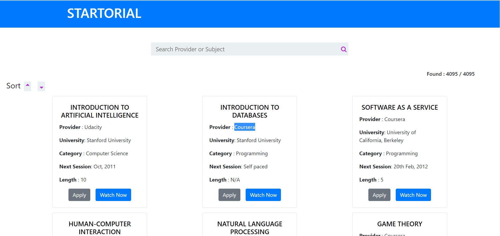
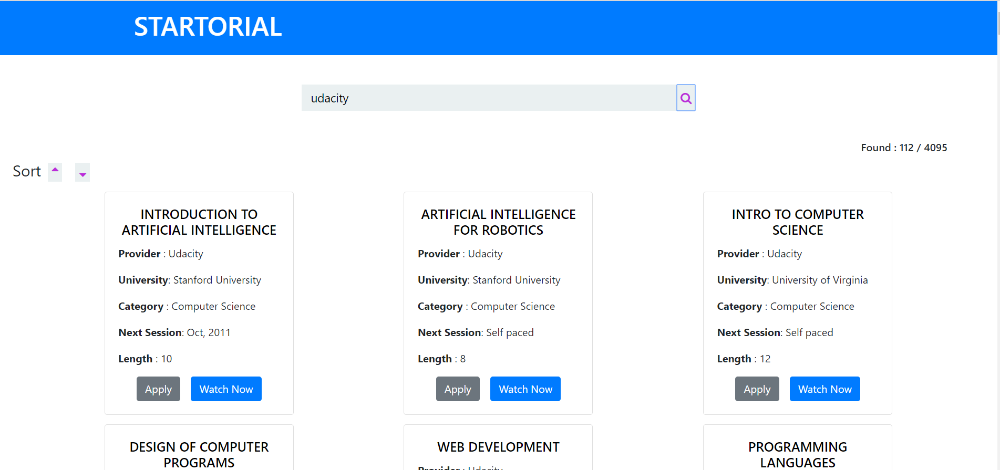
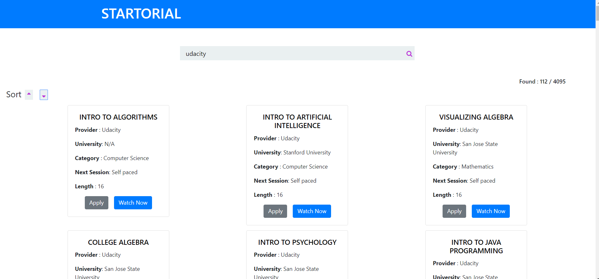

## Application Name
Startorial

## Author:
[Varun](https://github.com/varunprabhakaran22)

## Technology Used:
React, NodeJS, ExpressJs, MongoDB

## Objective:
The main objective of the application is to provide vast number of courses at a place. Find any course that you want hassle free 

## Description

Step1: The homepage presents you a mammoth collection of courses from various providers( udacity , Coursera and many more) \
Step2: you can select the course that you want based on the recommendation or you can follow the other two ways to get enrolled into your desired course 

1. Search by the title of the course of your desire in the search bar 
2. Search by the provider name say, Coursera, udacity, etc. 

## To run this project locally
Clone the project using Git Bash / Command prompt:
git clone https://github.com/varunprabhakaran22/ByjusCourse/

### Navigate inside the directory by:
cd startorial
## Install all required packages:
npm install
## Run dev server:
npm start

### Open your browser at http://localhost:3000/

## Screen Shots
## Homepage

## Filter Result

## Sorting 

